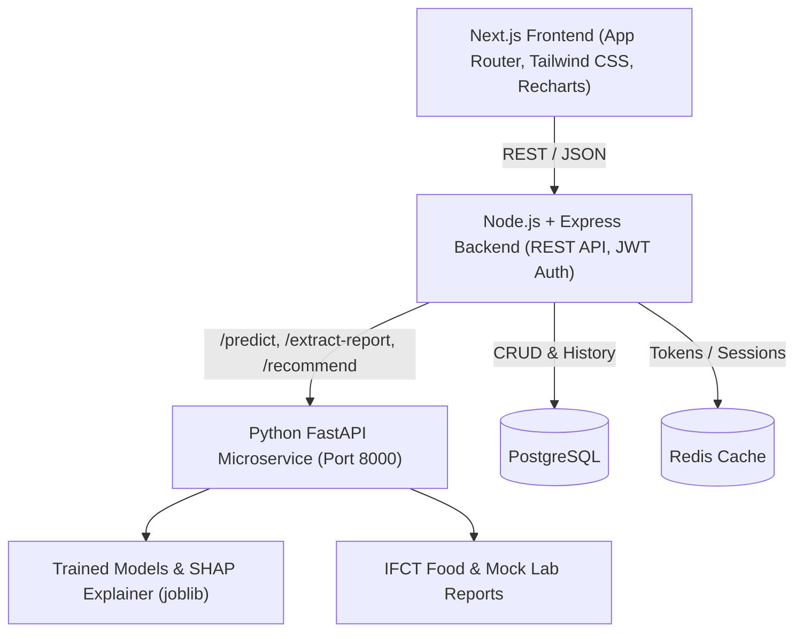

# LifeMap AI — Implementation Plan

LifeMap AI is a full-stack preventive healthcare platform that predicts disease risk (Type 2 Diabetes, Cardiovascular Disease) using machine learning, explains risk predictions using SHAP, digitizes lab reports via an OCR pipeline (OpenCV + Tesseract / PyPDF hybrid), and provides personalized, Indian-context diet (IFCT dataset) and exercise recommendations.

The system will run locally and be containerized via Docker Compose, adhering strictly to the **Review-1 design specifications**, class diagram entities, and the provided **Stitch UI design system** (`stitch_lifemap_ai_preventive_healthcare`).

---

## User Review Required

> [!IMPORTANT]
> **Workflow Agreement**: As requested, work will proceed in structured phases, with check-ins after each major phase:
> 1. **Phase 1**: ML Models trained, evaluated, saved, and served via FastAPI `/predict` with SHAP explainability.
> 2. **Phase 2**: Lab Report OCR & Regex parsing pipeline served via FastAPI `/extract-report`.
> 3. **Phase 3**: Indian Food Nutrition (IFCT) diet & exercise recommendation engine served via FastAPI `/recommend`.
> 4. **Phase 4**: Node.js + Express backend with PostgreSQL database schema (User, HealthProfile, MedicalReport, RiskPrediction, SHAPExplanation, DietPlan, ExercisePlan, WellnessLog) and Redis caching.
> 5. **Phase 5**: Next.js (App Router) frontend with TypeScript, Tailwind CSS, Recharts, and the exact clinical precision design tokens from `stitch_lifemap_ai_preventive_healthcare`.
> 6. **Phase 6**: Docker Compose multi-service setup (`docker-compose.yml`) for one-command local startup.

---

## Architecture Overview

---

## Proposed Changes

### Phase 1: Machine Learning Models & SHAP Explainability Engine
Organize datasets in `data/`, clean missing/zero values, conduct exploratory data analysis, train candidate models (Logistic Regression, Random Forest, XGBoost), compare metrics (Accuracy, F1-score, ROC-AUC), and serialize the best models.

#### [NEW] [ml_service/train_models.py](file:///c:/Users/rsaha/Downloads/LifeMap%20AI/ml_service/train_models.py)
- **Diabetes Dataset** (`archive (4)/diabetes_prediction_dataset.csv`):
  - Preprocess features: `gender`, `age`, `hypertension`, `heart_disease`, `smoking_history`, `bmi`, `HbA1c_level`, `blood_glucose_level`.
  - Train Logistic Regression, Random Forest, XGBoost Classifier.
  - Evaluate accuracy, precision, recall, F1, ROC-AUC; select top performer.
- **Cardiovascular Dataset** (`archive (2)/heart_disease_uci.csv`):
  - Handle missing data, impute medians/modes, encode categoricals (`sex`, `cp`, `restecg`, `thal`, `slope`).
  - Train Logistic Regression, Random Forest, XGBoost Classifier.
  - Select winning model.
- **SHAP Integration**:
  - Fit `shap.TreeExplainer` on the winning tree-based models (or appropriate explainer for LR).
  - Serialize models and preprocessors with `joblib` into `ml_service/models/`.

#### [NEW] [ml_service/explainability.py](file:///c:/Users/rsaha/Downloads/LifeMap%20AI/ml_service/explainability.py)
- Compute per-prediction SHAP feature contribution values.
- Categorize features into:
  - **Risk-Increasing Factors** (positive SHAP values pushing risk up, e.g., elevated glucose, higher BMI).
  - **Protective Factors** (negative SHAP values lowering risk, e.g., active lifestyle, healthy blood pressure).
- Generate plain-English friendly explanations matching the Stitch UI design (e.g. *"+14% impact: morning blood sugar a little high before breakfast — easy to reduce with quick post-meal walks"*).

#### [NEW] [ml_service/app.py](file:///c:/Users/rsaha/Downloads/LifeMap%20AI/ml_service/app.py)
- FastAPI application with CORS and health-check endpoint `/health`.
- `POST /predict`:
  - Accepts health metrics JSON (`age`, `gender`, `bmi`, `glucose`, `hba1c`, `systolic_bp`, `diastolic_bp`, `cholesterol`, `smoking_history`, etc.).
  - Returns `riskScore` (percentage 0-100), `riskCategory` (Low, Moderate, High), confidence score, and feature-level SHAP breakdown for both Diabetes and Heart Disease.

---

### Phase 2: OCR Report Ingestion Pipeline
Build an image & document preprocessing and OCR extraction pipeline to parse lab reports.

#### [NEW] [ml_service/ocr_pipeline.py](file:///c:/Users/rsaha/Downloads/LifeMap%20AI/ml_service/ocr_pipeline.py)
- Input handling: Accepts image files (JPG, PNG) and multi-page PDFs (from `mock_lab_reports/`).
- Image Preprocessing with OpenCV:
  - Grayscale conversion, deskewing using minimum bounding box / Hough transform, adaptive thresholding (Otsu / Gaussian), noise reduction.
- Hybrid OCR Extraction:
  - Uses `pytesseract` for scanned images/photos (`mock_scanned_photo_*.jpg`).
  - Integrates `pypdf` extraction for digital vector PDFs with automatic OCR fallback if raw text is empty.
- Regex Field Extraction:
  - `Glucose` (fasting / random blood sugar in mg/dL)
  - `Blood Pressure` (systolic and diastolic in mmHg)
  - `BMI` (kg/m²)
  - `Total Cholesterol` (mg/dL)
  - `HDL Cholesterol` (mg/dL)
  - `LDL Cholesterol` (mg/dL)
  - `Triglycerides` (mg/dL)
  - Patient metadata (`Name`, `Age`, `Gender`, `Date`).
- Add `POST /extract-report` in FastAPI:
  - Upload file multipart/form-data.
  - Returns raw OCR text and structured dictionary of extracted metrics with confidence markers.

---

### Phase 3: Indian-Context Recommendation Engine
Dietary and exercise planning tailored to the Indian population using the Indian Food Composition Tables (IFCT).

#### [NEW] [ml_service/recommend_engine.py](file:///c:/Users/rsaha/Downloads/LifeMap%20AI/ml_service/recommend_engine.py)
- Ingest `archive (3)/Indian_Food_Nutrition_Processed.csv` (1000+ Indian dishes: Calories, Carbs, Protein, Fats, Sugar, Fibre, Sodium, Micronutrients).
- **Rule-Based Diet Scoring & Filtering**:
  - If high diabetes risk / high glucose: filter for low free sugar, high dietary fibre, low glycemic index foods (e.g., *Methi paratha*, *Moong dal chilla*, *Sprouted pulses*, *Brown rice khichdi*).
  - If high cardiovascular risk / high LDL / high BP: prioritize low sodium (<140mg per serving), low saturated fat, rich in potassium/antioxidants.
  - Generate full-day balanced meal plan (Breakfast, Lunch, Evening Snack, Dinner) meeting estimated calorie targets (BMR/TDEE).
  - Food substitution support (`substituteItem()` function allowing alternative healthy Indian dishes).
- **Exercise Routine Engine**:
  - Suggest exercise regimes stratified by intensity (`Low`, `Moderate`, `Vigorous`) based on age, BMI, and cardiovascular risk.
  - Recommend culturally accessible physical activities (e.g., Brisk Walking after meals, Yoga/Pranayama, Surya Namaskar, Cycling, Light Strength Training).
- Add `POST /recommend` in FastAPI:
  - Accepts risk factors, user profile, calorie targets, and dietary preferences (vegetarian / standard).
  - Returns structured `DietPlan` and `ExercisePlan`.

---

### Phase 4: Backend (Node.js + Express + PostgreSQL + Redis)
Full REST API implementing the Review-1 UML Class Diagram.

#### [NEW] [backend/src/db/schema.sql](file:///c:/Users/rsaha/Downloads/LifeMap%20AI/backend/src/db/schema.sql)
Tables aligned with Class Diagram:
- `users` (`user_id`, `name`, `email`, `password_hash`, `role`, `created_at`)
- `health_profiles` (`profile_id`, `user_id`, `age`, `gender`, `height`, `weight`, `bmi`, `lifestyle_factors`, `updated_at`)
- `medical_reports` (`report_id`, `user_id`, `upload_date`, `raw_image_url`, `ocr_text`, `extracted_metrics`)
- `risk_predictions` (`prediction_id`, `user_id`, `disease_type`, `risk_score`, `model_version`, `created_at`)
- `shap_explanations` (`explanation_id`, `prediction_id`, `top_features`, `shap_values`)
- `diet_plans` (`plan_id`, `user_id`, `calorie_target`, `meals`, `created_at`)
- `exercise_plans` (`plan_id`, `user_id`, `intensity`, `routines`, `created_at`)
- `wellness_logs` (`log_id`, `user_id`, `date`, `metrics`, `notes`, `created_at`)

#### [NEW] [backend/src/routes/](file:///c:/Users/rsaha/Downloads/LifeMap%20AI/backend/src/routes)
- `auth`: `POST /api/auth/register`, `POST /api/auth/login`, `GET /api/auth/me`
- `profile`: `GET /api/profile`, `PUT /api/profile`
- `reports`: `POST /api/reports/upload` (forwards to FastAPI `/extract-report`, stores in `medical_reports`)
- `predictions`: `POST /api/predictions/run` (calls FastAPI `/predict`, stores `risk_predictions` and `shap_explanations`), `GET /api/predictions/latest`, `GET /api/predictions/history`
- `recommendations`: `GET /api/recommendations/current`, `POST /api/recommendations/generate` (calls FastAPI `/recommend`, stores `diet_plans` and `exercise_plans`)
- `wellness`: `GET /api/wellness/logs`, `POST /api/wellness/logs` (stores `wellness_logs`)

---

### Phase 5: Frontend (Next.js App Router + TypeScript + Tailwind CSS + Recharts)
Directly incorporates the design system from `stitch_lifemap_ai_preventive_healthcare`:
- Emerald/teal medical aesthetic (`#00685f` primary, `#5bb8fe` secondary, `#faf8ff` surface, `#eaedff` surface container).
- Google Fonts: *Plus Jakarta Sans* (headlines/metrics) and *Inter* (body/labels).
- Material Symbols Outlined icons.

#### Pages to Implement:
1. **`/login` & `/register`**: Clean clinical authentication portal with individual and health-coach role selection.
2. **`/dashboard`**:
   - Welcome banner with friendly AI clinical insights.
   - Disease risk summary cards (Type 2 Diabetes, Cardiovascular Disease) with color-coded risk gauges.
   - Quick action buttons (📄 Upload Lab Report, ➕ Log Health Numbers).
   - Recent vitals overview and upcoming wellness goals.
3. **`/log-data`**:
   - 2-minute multi-section health checkup form:
     - Section 1: Everyday Numbers (Age, Fasting Blood Sugar, Systolic/Diastolic BP, Height & Weight with live BMI calculation).
     - Section 2: Lab Test Numbers (Cholesterol, HDL, LDL, Triglycerides, HbA1c).
     - Section 3: Lifestyle Factors (Physical activity, smoking status).
   - Embedded Report Upload Modal with real-time OCR parsing and autofill.
4. **`/results`**:
   - Disease risk score cards with progress gauges and reversible guidance.
   - **SHAP Explanation Bar Chart & Driver Cards**:
     - Visual breakdown of factors pushing risk up (Rose/Red) vs. factors pulling risk down (Emerald/Teal).
     - Actionable clinical interpretation in plain English.
5. **`/recommendations`**:
   - Personalized Indian Diet Plan categorized by breakfast, lunch, snack, dinner with calorie and macronutrient breakdown.
   - Substitute meal suggestion tool.
   - Tailored exercise routine with intensity level and duration.
6. **`/wellness`**:
   - Historical trend line chart (using Recharts) tracking glucose, blood pressure, BMI, and predicted risk scores over time.
   - Filterable wellness log history table.
   - Quick "Log Today's Numbers" modal.

---

### Phase 6: Docker Compose Multi-Service Setup
- `docker-compose.yml` defining:
  - `db`: PostgreSQL 16 with init script executing `schema.sql`.
  - `redis`: Redis 7 alpine for session caching.
  - `fastapi-ml`: Python container with `tesseract-ocr`, `libgl1`, scikit-learn, XGBoost, SHAP, and FastAPI.
  - `node-backend`: Express REST API connecting to Postgres, Redis, and FastAPI.
  - `next-frontend`: Next.js production/dev build connecting to the Node backend.
- Single command execution: `docker-compose up --build`.

---

## Verification Plan

### Automated Verification
1. **ML Model Evaluation**: Run training script `python ml_service/train_models.py`, verify Accuracy, F1, and AUC for Logistic Regression, Random Forest, and XGBoost; verify saved `.joblib` artifacts.
2. **FastAPI Endpoints**:
   - Test `POST /predict` with test payload -> verify 200 OK, risk probabilities, and non-empty SHAP values.
   - Test `POST /extract-report` with sample PDF and JPG from `mock_lab_reports/` -> verify extracted fields.
   - Test `POST /recommend` with risk profile -> verify generated meals and exercise routines.
3. **Backend API Endpoints**:
   - Register/login flow, profile update, predictions test, report upload test, wellness log creation.
4. **Frontend Build**:
   - Run `npm run build` in `frontend` to verify TypeScript types and Next.js route builds without error.

### Manual Verification
- Walk through user flow: Register -> Upload Mock Lab Report -> Auto-populate fields -> Submit to predict risk -> Inspect SHAP bars and plain-English drivers -> Review Indian diet recommendations -> View wellness trends.
